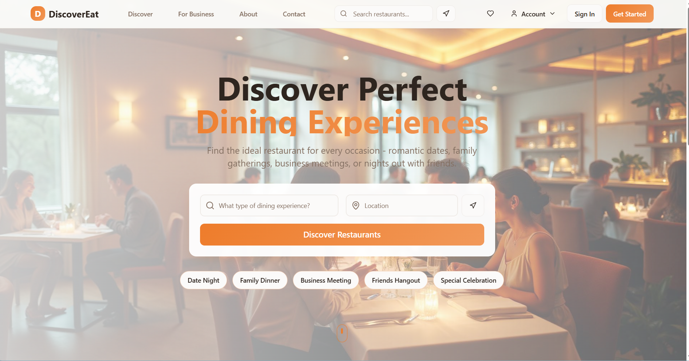
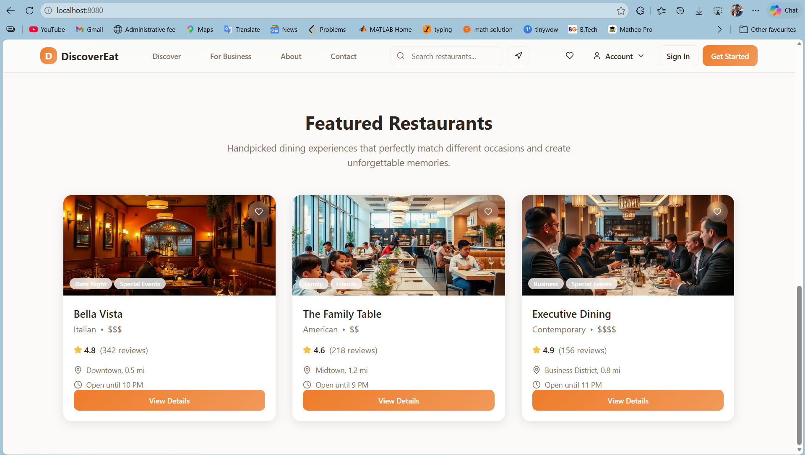
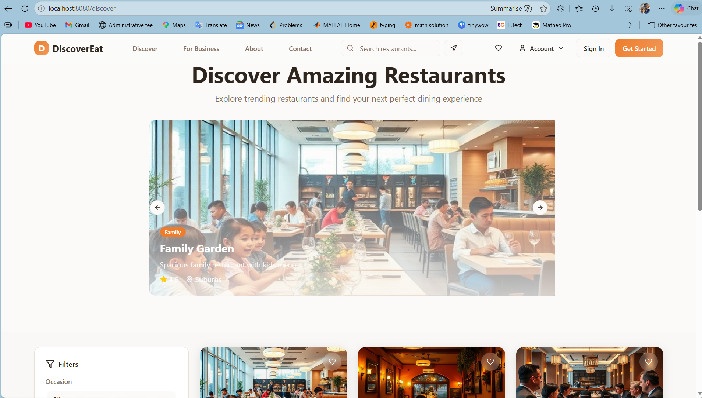
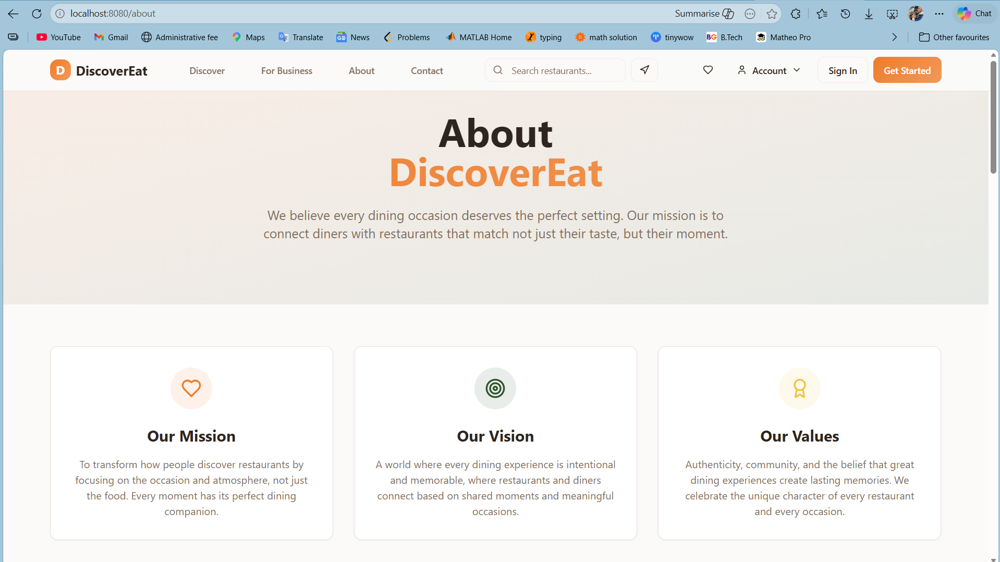
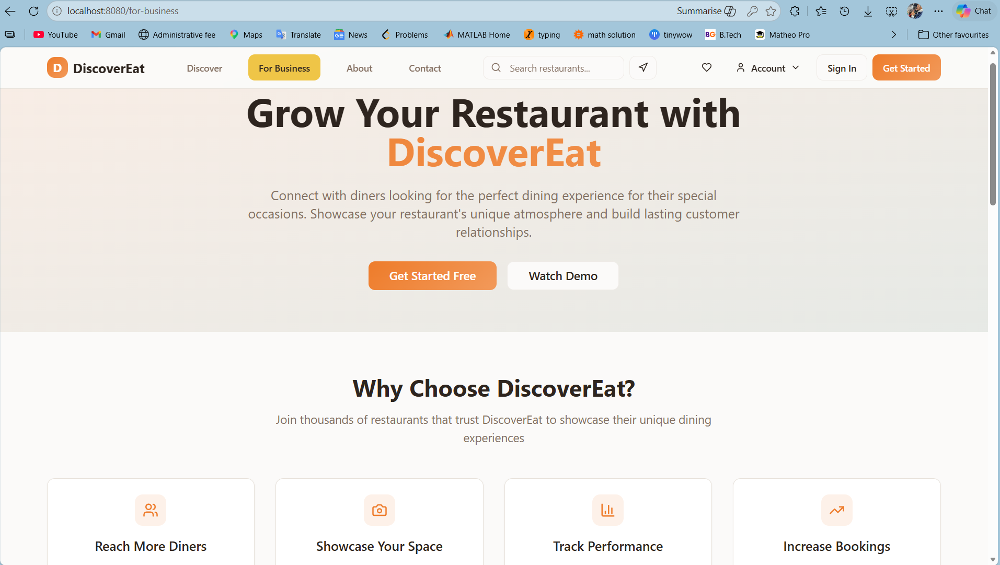
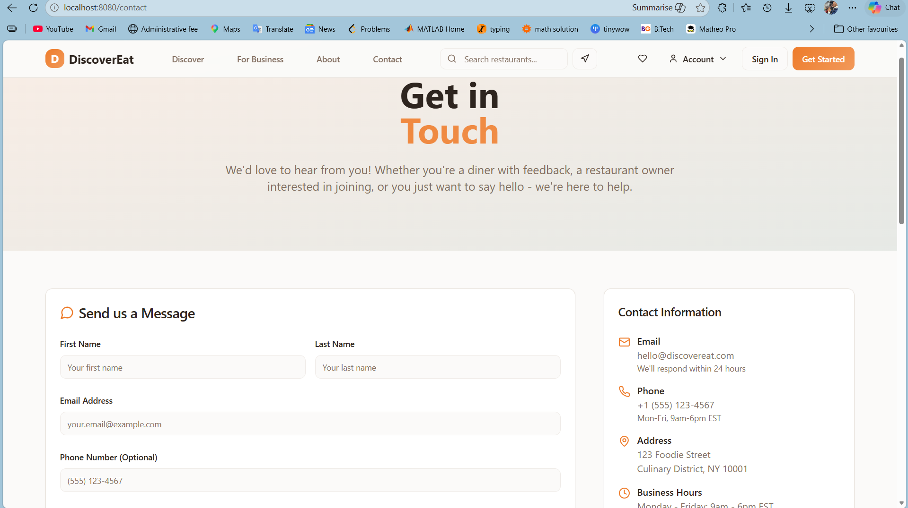

# DiscoverEat — Restaurant Discovery Platform

> An occasion-based restaurant discovery web application built with React, TypeScript, and Vite.

**Course:** Web Systems Development — Mini-Project  
**Student:** Abdul Hakim NAZARI  
**University:** University of Maribor  
**Date:** May 2026

---

## About

DiscoverEat is a web application that reframes restaurant discovery around the **purpose of the visit** rather than just proximity or food type. Users select their dining occasion first — Date Night, Family Dinner, Business Meeting, Friends Hangout, or Special Celebration — and are then matched with restaurants curated for that specific context.

This approach addresses a gap in existing platforms (Google Maps, TripAdvisor, Yelp) which are primarily location-centric and fail to capture the social context, atmosphere, or vibe of a dining experience.

---

## Screenshots

| Home Page | Featured Restaurants |
|:-:|:-:|
|  |  |

| Discover Page | About Page |
|:-:|:-:|
|  |  |

| Business Portal | Contact Page |
|:-:|:-:|
|  |  |

---

## Features

- **Occasion-Based Discovery** — Filter restaurants by occasion type (Date Night, Family Dinner, Business Meeting, Friends Hangout, Special Celebration)
- **Location-Based Search** — Find restaurants by city or location with Mapbox integration
- **Interactive Maps** — Visualize restaurant locations on an interactive Mapbox GL map
- **Featured Restaurants** — Auto-playing carousel showcasing trending restaurants
- **Detailed Restaurant Profiles** — View ratings, photo galleries with lightbox, tabbed menus, atmosphere details, and operating hours
- **User Favorites** — Save and manage favorite restaurants (heart toggle with microinteraction)
- **User Authentication** — Sign-in and registration flow
- **User Profiles** — Editable profile with dining preferences
- **Business Portal** — Information page for restaurant owners
- **Responsive Design** — Mobile-first layout across all breakpoints
- **Dark/Light Mode** — Theme support via system preferences

---

## Tech Stack

| Category | Technology |
|---|---|
| **Build Tool** | [Vite](https://vitejs.dev/) 5 with SWC |
| **UI Library** | [React](https://react.dev/) 18 |
| **Language** | [TypeScript](https://www.typescriptlang.org/) 5 |
| **Component Library** | [shadcn/ui](https://ui.shadcn.com/) (built on Radix UI) |
| **Styling** | [Tailwind CSS](https://tailwindcss.com/) 3 |
| **Routing** | [React Router](https://reactrouter.com/) v6 |
| **Maps** | [Mapbox GL JS](https://docs.mapbox.com/mapbox-gl-js/) |
| **Data Fetching** | [TanStack Query](https://tanstack.com/query/) v5 |
| **Forms** | [React Hook Form](https://react-hook-form.com/) + [Zod](https://zod.dev/) |
| **Charts** | [Recharts](https://recharts.org/) |
| **Carousel** | [Embla Carousel](https://www.embla-carousel.com/) |
| **Notifications** | [Sonner](https://sonner.emilkowal.dev/) |
| **Icons** | [Lucide React](https://lucide.dev/) |
| **Linting** | [ESLint](https://eslint.org/) 9 |

---

## Getting Started

### Prerequisites

- [Node.js](https://nodejs.org/) v16 or higher
- npm package manager

### Installation

```sh
# Clone the repository
git clone https://github.com/Hakim-CS/discoverEat.git

# Navigate to the project directory
cd discoverEat

# Install dependencies
npm install

# Start the development server
npm run dev
```

The application will be available at **http://localhost:8080**

### Available Scripts

| Command | Description |
|---|---|
| `npm run dev` | Start development server with hot reload |
| `npm run build` | Build for production |
| `npm run build:dev` | Build in development mode |
| `npm run preview` | Preview the production build locally |
| `npm run lint` | Run ESLint to check code quality |

---

## Project Structure

```
discoverEat/
├── docs/                        # Project documentation
│   ├── discoverEat_documentation.md   # Full design & prototype documentation
│   ├── DiscoverEat - Project Report.pdf
│   ├── presentation.pptx
│   ├── Persona/                 # User persona assets
│   ├── diagram/                 # Use case & architecture diagrams
│   ├── wireframs/               # Wireframe designs
│   └── screenshots/             # Application screenshots
├── public/                      # Static assets (favicon, robots.txt)
├── src/
│   ├── assets/                  # Images (hero, restaurant photos)
│   ├── components/              # Reusable UI components
│   │   ├── ui/                  # shadcn/ui base components (49 files)
│   │   ├── Navigation.tsx       # Main navigation bar with mobile menu
│   │   ├── HeroSection.tsx      # Landing page hero with search
│   │   ├── SearchBar.tsx        # Restaurant search functionality
│   │   ├── SearchSuggestions.tsx # Autocomplete search suggestions
│   │   ├── SearchResults.tsx    # Search results display
│   │   ├── FeaturedRestaurants.tsx  # Featured restaurant carousel
│   │   ├── RestaurantCard.tsx   # Restaurant card component
│   │   ├── OccasionFilter.tsx   # Occasion category filter
│   │   ├── LocationSearch.tsx   # Location-based search
│   │   ├── Map.tsx              # Interactive Mapbox map
│   │   └── MapboxTokenInput.tsx # Mapbox API configuration
│   ├── hooks/                   # Custom React hooks
│   │   ├── useRestaurantSearch.tsx  # Restaurant search logic
│   │   ├── useGeolocation.tsx   # Browser geolocation API
│   │   ├── use-toast.ts         # Toast notification hook
│   │   └── use-mobile.tsx       # Mobile device detection
│   ├── lib/
│   │   └── utils.ts             # Utility functions (cn helper)
│   ├── pages/                   # Page-level route components
│   │   ├── Index.tsx            # Home / landing page
│   │   ├── Discover.tsx         # Restaurant discovery with filters
│   │   ├── RestaurantDetail.tsx # Restaurant detail page
│   │   ├── Favorites.tsx        # Saved favorites
│   │   ├── Profile.tsx          # User profile management
│   │   ├── SignIn.tsx           # Sign-in page
│   │   ├── Register.tsx         # Registration page
│   │   ├── About.tsx            # About DiscoverEat
│   │   ├── Contact.tsx          # Contact form
│   │   ├── ForBusiness.tsx      # Business owner portal
│   │   └── NotFound.tsx         # 404 page
│   ├── App.tsx                  # Root component with routing
│   ├── App.css                  # App-specific styles
│   ├── index.css                # Global styles & Tailwind config
│   └── main.tsx                 # Application entry point
├── index.html                   # HTML entry point
├── vite.config.ts               # Vite configuration
├── tailwind.config.ts           # Tailwind CSS configuration
├── tsconfig.json                # TypeScript configuration
├── eslint.config.js             # ESLint configuration
├── components.json              # shadcn/ui configuration
└── package.json                 # Dependencies & scripts
```

---

## Page Routes

| Route | Page | Description |
|---|---|---|
| `/` | Home | Landing page with hero, search, occasion filters, and featured restaurants |
| `/discover` | Discover | Browse and filter all restaurants by occasion, location, and keyword |
| `/restaurant/:id` | Restaurant Detail | Full restaurant profile with photos, menu, map, and contact info |
| `/favorites` | Favorites | User's saved favorite restaurants |
| `/profile` | Profile | User account settings and preferences |
| `/signin` | Sign In | User authentication |
| `/register` | Register | New user registration |
| `/about` | About | About DiscoverEat and team |
| `/contact` | Contact | Contact form and support |
| `/for-business` | Business Portal | Information for restaurant owners |
| `*` | Not Found | 404 error page |

---

## Documentation

The `docs/` directory contains the full project documentation:

- **[discoverEat_documentation.md](docs/discoverEat_documentation.md)** — Complete design & prototype documentation including problem description, user personas, functional/non-functional requirements, use case model, design trends analysis, and design evolution
- **DiscoverEat - Project Report.pdf** — Formal project report
- **presentation.pptx** — Project presentation slides
- **Persona/** — User persona visual assets
- **diagram/** — Use case and architecture diagrams
- **wireframs/** — Wireframe designs from the design phase
- **screenshots/** — Application screenshots

---

## Design Highlights

Three modern design trends were intentionally selected and applied:

1. **Responsive / Mobile-First Design** — Built with Tailwind CSS mobile-first breakpoints. Navigation collapses to hamburger menu, card grids adapt from 3-column to 1-column, and touch targets are optimized for mobile use.

2. **Microinteractions** — Hover scale effects on occasion cards, animated heart toggle on favorites, bouncing scroll indicator on hero, smooth carousel transitions, and elevation changes on card hover.

3. **Bold Typography & Visual Hierarchy** — Large hero headlines with gradient text, clear heading hierarchy, and consistent font weight scaling for scannable content.

---

## Academic Context

This project was developed as the mini-project assignment for the **Web Systems Development** course. It is a **frontend prototype** — restaurant data is mock/hardcoded and there is no backend server or database. The focus is on UI/UX design, modern frontend architecture, and the application of web design trends.

For the full design rationale, requirements specification, and design evolution, see the [project documentation](docs/discoverEat_documentation.md).
